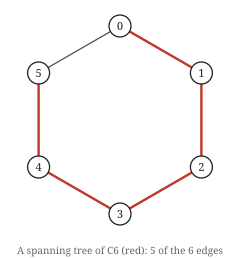

# Chapter 7 — Spanning trees and Cayley's formula

A **spanning tree** of `G` is a subgraph that is a tree and includes every vertex. It is the
cheapest way to keep a graph connected, and counting how many a graph has turns out to be a
much richer question than it looks.

## Existence



A spanning tree of `C₆`: delete any one edge of the cycle and what remains is a tree on all
six vertices. `C₆` has exactly six spanning trees, one per deleted edge.


> **Theorem.** Every connected graph has a spanning tree.

*Proof.* Among all connected spanning subgraphs of `G`, take one with the fewest edges; call
it `T`. If `T` contained a cycle, removing an edge of that cycle would leave it connected
(Chapter 6) and use fewer edges, contradicting minimality. So `T` is connected and acyclic:
a tree. ∎

That is the **extremal argument**, and it is the second general move worth naming after the
longest-path trick. Take the extreme object, then show that any defect would let you go
further. Chapters 13 and 27 use it again.

The proof is not an algorithm — "take a minimal one" is not a procedure — but two
algorithms fall out immediately, and Chapter 8 gives both: the BFS tree and the DFS tree of
a connected graph are spanning trees, each computed in `O(n + m)`.

## Counting them

How many spanning trees does a graph have? For `K₅`, brute force says 125. For `K₆`, 1296.
Those are `5³` and `6⁴`.

> **Theorem (Cayley, 1889).** The complete graph `K_n` has exactly `n^(n-2)` labelled
> spanning trees — equivalently, there are `n^(n-2)` distinct trees on a fixed vertex set of
> size `n`.

The exhaustive count agrees, which is worth doing before trusting any proof:

```
  K_2: cayley n^(n-2) =      1   enumerated = 1
  K_3: cayley n^(n-2) =      3   enumerated = 3
  K_4: cayley n^(n-2) =     16   enumerated = 16
  K_5: cayley n^(n-2) =    125   enumerated = 125
  K_6: cayley n^(n-2) =   1296   enumerated = 1296
```

The word **labelled** is doing critical work. Up to isomorphism there are only 6 trees on 6
vertices; there are 1296 trees *on the vertex set* `{0,…,5}`. Chapter 5's distinction
between equality and isomorphism is exactly the difference, and confusing the two makes
Cayley's formula look absurd.

## The Prüfer bijection

There are several proofs. This one is the best, because it does not merely count the trees
— it *names* them.

> **Theorem (Prüfer).** For `n ≥ 2` there is a bijection between labelled trees on
> `{0, …, n-1}` and sequences of length `n - 2` over `{0, …, n-1}`.

Since there are `n^(n-2)` such sequences, Cayley's formula follows immediately.

**Encoding.** While more than two vertices remain, find the leaf with the smallest label,
record its unique neighbour, and delete the leaf. Stop when two vertices remain.

```python
def to_prufer(t):
    degree = [t.degree(v) for v in t.vertices()]
    neighbours = [set(t.neighbours(v)) for v in t.vertices()]
    seq = []
    for _ in range(t.n - 2):
        leaf = min(v for v in t.vertices() if degree[v] == 1)
        parent = next(iter(neighbours[leaf]))
        seq.append(parent)
        degree[leaf] = 0
        neighbours[parent].discard(leaf)
        degree[parent] -= 1
    return seq
```

**Decoding.** Given a sequence, compute each vertex's degree as one plus the number of times
it appears. Then repeatedly take the smallest-labelled vertex of degree 1 that has not yet
been used, join it to the next sequence entry, and decrement both degrees. Finally join the
two remaining degree-1 vertices.

*Proof that these are inverse.* The key observation is that **a vertex appears in the
sequence exactly `deg(v) - 1` times**. A leaf therefore never appears, and an internal
vertex appears at least once. So the decoder can identify the leaf removed at each step —
it is the smallest label not appearing in the remaining sequence and not yet consumed —
which is exactly the leaf the encoder chose. By induction on `n`, each step of the decoder
undoes the corresponding step of the encoder. Both maps are therefore well defined and
mutually inverse, so each is a bijection. ∎

That degree observation is the whole proof, and it is also the fastest way to read
information out of a Prüfer sequence without decoding it:

```python
from graphs.core import Graph, path
from graphs.generate import to_prufer, from_prufer

star = Graph(5, [(0, 1), (0, 2), (0, 3), (0, 4)])
print(to_prufer(star))          # [0, 0, 0]
print(to_prufer(path(5)))       # [1, 2, 3]
print(sorted(from_prufer([0, 0, 0]).edges()))
# [(0, 1), (0, 2), (0, 3), (0, 4)]
```

The star's centre has degree 4 and appears `4 - 1 = 3` times. The path's two ends have
degree 1 and never appear. You can read the degree sequence straight off.

A corollary that would be fiddly to prove directly falls out for free: **the number of
labelled trees on `n` vertices with prescribed degrees `d₁, …, dₙ` is the multinomial
coefficient `(n-2)! / ∏(dᵢ - 1)!`** — because that is exactly how many sequences have each
vertex `i` appearing `dᵢ - 1` times.

## Counting for general graphs

Cayley's formula handles `K_n`. For an arbitrary graph, the answer is the **matrix–tree
theorem**: the number of spanning trees equals any cofactor of the Laplacian matrix. It
computes in `O(n³)` by a determinant, without enumerating anything.

That theorem needs the Laplacian, so it waits for Chapter 30. It is worth flagging now as
the single largest gap between what this chapter can do and what is possible: `spanning_trees`
in this book's library enumerates `C(m, n-1)` subsets and tests each, which is why the
Cayley check above stops at `K₆`. The matrix–tree theorem gets `K₆`'s 1296 from a 5×5
determinant.

## Try it

Watch the bijection round-trip on a random tree, and check the degree observation:

```bash
python -c "
import sys, random; sys.path.insert(0, '.')
from graphs.generate import random_tree, to_prufer, from_prufer
rng = random.Random(11)
t = random_tree(8, rng)
seq = to_prufer(t)
print('prufer sequence:', seq)
print('degrees:        ', [t.degree(v) for v in t.vertices()])
print('appearances+1:  ', [seq.count(v) + 1 for v in t.vertices()])
print('round trips:    ', sorted(from_prufer(seq).edges()) == sorted(t.edges()))
"
```

```
prufer sequence: [7, 7, 7, 3, 2, 7]
degrees:         [1, 1, 2, 2, 1, 1, 1, 5]
appearances+1:   [1, 1, 2, 2, 1, 1, 1, 5]
round trips:     True
```

The second and third lines are identical, which is the lemma the whole proof turns on.

## Exercises

1. How many labelled spanning trees does `K₄` have? Check against Cayley's formula.
2. Compute the Prüfer sequence of the path `0—1—2—3` by hand.
3. A vertex appears `deg(v) − 1` times in a Prüfer sequence. What does that say about the
   labels that never appear?
4. There are 1296 labelled trees on 6 vertices but only 6 up to isomorphism. Explain the gap
   in one sentence.

Solutions in [Appendix E](../appendices/e-solutions.md).

## Takeaways

- Every connected graph has a spanning tree, by the extremal argument: take a minimal
  connected spanning subgraph and show it cannot contain a cycle.
- `K_n` has `n^(n-2)` **labelled** spanning trees. Up to isomorphism the count is far
  smaller, and conflating the two makes the formula look wrong.
- The Prüfer bijection proves Cayley's formula by naming each tree with a sequence. The
  lemma that carries it: vertex `v` appears exactly `deg(v) - 1` times.
- Prescribed-degree tree counts fall out of the same bijection as a multinomial
  coefficient, with no extra work.
- Counting spanning trees of a general graph is the matrix–tree theorem, `O(n³)` via a
  determinant. This chapter's enumerator is exponential and stops at `K₆`.
