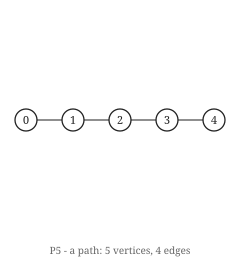
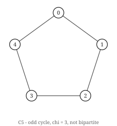
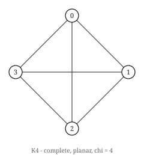
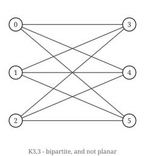
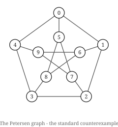

# Hoofdstuk 1 — Wat een graaf is

Een graaf is een verzameling dingen en een verzameling paren van die dingen. Dat is de hele
definitie, en bijna alles wat moeilijk is in dit boek komt voort uit hoe weinig ze zegt.

## De definitie

Een **graaf** `G` is een paar `(V, E)` waarbij `V` een eindige verzameling **knopen** is en
`E` een verzameling ongeordende paren van verschillende knopen: de **kanten**.

Lees dat nog eens over, en let op wat het uitsluit. `E` is een *verzameling*, dus er bestaat
niet zoiets als twee kanten tussen hetzelfde paar — je hebt de kant, of je hebt hem niet. De
paren bestaan uit *verschillende* knopen, dus geen knoop verbindt zichzelf. De paren zijn
*ongeordend*, dus een kant van `u` naar `v` is hetzelfde object als een kant van `v` naar `u`.
En `V` is *eindig*, wat in dit boek overal geldt en wat echt onderzoek vaak laat vallen.

Een graaf die aan dit alles voldoet heet **enkelvoudig**, en tenzij een hoofdstuk anders
zegt, is elke graaf hier enkelvoudig. De drie versoepelingen hebben elk een naam:

- herhaalde kanten toestaan geeft een **multigraaf**;
- een kant van een knoop naar zichzelf toestaan geeft een **lus**;
- de paren geordend maken geeft een **gerichte graaf**, of **digraaf**.

Hoofdstuk 10 en 13 hebben richtingen en gewichten nodig en voeren ze daar in. Alles ervoor
redt het zonder.

Twee getallen komen zo vaak voor dat ze één letter krijgen: `n = |V|` en `m = |E|`. Zie je
`O(n + m)` in dit boek — en dat zul je voortdurend — dan is dat de grootte van de graaf, en
van niets anders.

```python
from graphs.core import Graph

g = Graph(4, [(0, 1), (1, 2), (2, 3), (3, 0)])
print(g.n, g.m)                    # 4 4
print(sorted(g.edges()))           # [(0, 1), (0, 3), (1, 2), (2, 3)]
print(g.neighbours(1))             # {0, 2}
```

De knopen heten hier `0, 1, 2, 3`. Niets dwingt daartoe; knopen kunnen steden zijn, mensen,
of webpagina's. Dit boek gebruikt overal gehele getallen omdat ze in arrays indexeren, en
hoofdstuk 2 gaat erover waarom dat meer uitmaakt dan het klinkt.

## De tekening is de graaf niet

  

Drie van de vijf hieronder genoemde grafen, getekend. Elke prent is *een* keuze — de graaf
levert geen posities, en hoofdstuk 17 gaat over wat die keuze wel en niet overleeft.

Teken de graaf hierboven en je krijgt een vierkant. Teken hem opnieuw met de knopen in een
andere volgorde en je krijgt een vlinderdas met een kruising in het midden. Beide tekeningen
zijn correct, want **een graaf heeft geen meetkunde**. Er zijn geen posities, geen lengtes,
geen hoeken, en geen begrip van de ene kant die de andere kruist. Een tekening voegt dat
allemaal toe, en niets ervan is gegeven.

Dit is de meest voorkomende beginnersfout, en ze overleeft ruimschoots het beginnersstadium:
redeneren over een graaf met behulp van een eigenschap van de tekening die je ervan maakte.
De prent heeft een links en een rechts. De graaf niet.

Het onderscheid is geen muggenzifterij, want twee gevallen doen er later toe en ze trekken
in tegengestelde richting:

- **Vlakheid** (hoofdstuk 17) is de vraag of *een of andere* tekening kruisingen vermijdt.
  Dat is een eigenschap van de graaf, juist omdat het over alle tekeningen kwantificeert. De
  tekening die je toevallig maakte zegt niets.
- **Grafenopmaak**, het probleem om een tekening te maken die een mens kan lezen, is helemaal
  geen grafentheorie. Het is optimalisatie over een ruimte waarvan de graaf niets weet.

Houd het verschil scherp en hoofdstuk 17 is eenvoudig. Vervaag het en de stelling van
Kuratowski lijkt over plaatjes te gaan.

## Wat een graaf niet kan zeggen

De definitie is karig, en het is de moeite waard te benoemen wat ze weglaat, want naar een
graaf grijpen wanneer je een van deze dingen nodig hebt, is hoe modellen misgaan.

**Relaties tussen drie of meer dingen tegelijk.** Een kant verbindt precies twee knopen. Is
je relatie werkelijk drieledig — drie auteurs op één artikel, drie reagentia in één reactie —
dan gaat er informatie verloren als je haar als drie paarsgewijze kanten codeert, en je krijgt
haar niet terug. De driehoek `{a,b}, {b,c}, {a,c}` is niet te onderscheiden van drie
afzonderlijke samenwerkingen die elkaar nooit ontmoetten. Wat je wilt is een **hypergraaf**,
waarin een kant een willekeurige deelverzameling is.

**Volgorde of veelvoud.** Twee vluchten tussen dezelfde steden zijn één kant. Doet de tweede
vlucht ertoe, dan heb je een multigraaf nodig, en de standaardresultaten veranderen: het
handdruklemma van hoofdstuk 3 blijft overeind, de karakterisering van bomen in hoofdstuk 6
niet.

**Iets over de knopen zelf.** Een graaf weet niet dat knoop 3 een persoon is. Attributen
leven buiten de structuur, in een woordenboek dat je ernaast draagt. Dat is een voordeel —
elke stelling in dit boek geldt ongeacht wat de knopen betekenen — maar het betekent dat een
graaf alleen zelden een volledig model van iets is.

**Richting, tenzij je erom vraagt.** "Alice volgt Bob" is niet symmetrisch, en dat modelleren
met een ongerichte kant is een leugen die zichzelf niet aankondigt. Ruwweg de helft van de
resultaten in dit boek heeft een gerichte tegenhanger; sommige zijn moeilijker (hoofdstuk 12),
sommige eenvoudiger, en sommige onwaar.

## Een eerste familie grafen

 

`K₃,₃` getekend als twee kolommen, wat zijn bipartietheid meteen zichtbaar maakt; de
Petersen-graaf in zijn gebruikelijke vijfhoek-met-pentagram-opmaak. Geen van beide tekeningen
wordt door de graaf afgedwongen.

Vijf grafen komen zo vaak voor dat ze een naam krijgen, en je zou alle vijf voor je moeten
kunnen zien.

| Naam | Notatie | `n` | `m` |
|---|---|---|---|
| Volledige graaf | `K_n` | `n` | `n(n-1)/2` |
| Lege graaf | — | `n` | `0` |
| Pad | `P_n` | `n` | `n - 1` |
| Cykel | `C_n` (`n ≥ 3`) | `n` | `n` |
| Volledig bipartiet | `K_{a,b}` | `a + b` | `ab` |

```python
from graphs.core import complete, cycle, complete_bipartite, petersen

print(complete(5).m)             # 10  = 5*4/2
print(cycle(7).m)                # 7
print(complete_bipartite(3, 3).m)  # 9
print(petersen().degree_sequence())  # [3, 3, 3, 3, 3, 3, 3, 3, 3, 3]
```

De laatste is de **Petersen-graaf**, en die verdient zijn plaats als het standaard
tegenvoorbeeld van dit boek. Hij is 3-regulier, hij is niet vlak, hij is niet
Hamiltoniaans, en zijn chromatisch getal is 3. Vrijwel elk plausibel klinkend vermoeden dat
een lezer in de hoofdstukken 15 tot 20 verzint, sneuvelt op de Petersen-graaf, en dat is de
efficiëntste reden om hem nu al uit het hoofd te leren.

## Probeer het

Overtuig jezelf ervan dat de tekening geen informatie draagt, door dezelfde graaf op twee
manieren te bouwen en te controleren dat ze gelijk zijn als *gelabelde* grafen:

```bash
python -c "
from graphs.core import Graph, cycle
square = Graph(4, [(0,1),(1,2),(2,3),(3,0)])
bowtie = Graph(4, [(3,0),(2,3),(0,1),(1,2)])
print('same graph:', square == bowtie)
print('is it C_4:', square == cycle(4))
"
```

```
same graph: True
is it C_4: True
```

De kantenlijsten zijn in verschillende volgorde geschreven en de ene werd omschreven als een
vierkant en de andere als een vlinderdas. Het is hetzelfde object, en `Graph.__eq__` trekt
zich niets aan van hoe je het tekende.

Probeer nu de moeilijkere versie, waarin de *labels* verschillen:

```bash
python -c "
from graphs.core import Graph, cycle
relabelled = Graph(4, [(0,2),(2,1),(1,3),(3,0)])
print('equal as labelled graphs:', relabelled == cycle(4))
"
```

```
equal as labelled graphs: False
```

Beide zijn viercykels. Ze zijn niet gelijk, want gelijkheid van gelabelde grafen vraagt of
*dezelfde paren* verbonden zijn, en dat zijn ze hier niet. De relatie die je eigenlijk wilde
is isomorfie, en die is lastig genoeg om hoofdstuk 5 helemaal voor zich te krijgen.

## Oefeningen

1. `K_n` heeft `n(n−1)/2` kanten. Verifieer dit voor `n = 6` door te tellen, en controleer het
   tegen `complete(6).m`.
2. De Petersen-graaf is 3-regulier op 10 knopen. Hoeveel kanten heeft hij, zonder ze een voor
   een te tellen?
3. Schrijf twee verschillende kantenlijsten die *dezelfde gelabelde graaf* opleveren, en één
   die een andere gelabelde graaf op dezelfde knopen geeft.
4. Drie auteurs schrijven samen één artikel. Leg uit wat er verloren gaat wanneer dit als
   drie paarsgewijze kanten wordt gemodelleerd, en noem de structuur die het niet verliest.

Oplossingen in Bijlage E.

## Kernpunten

- Een graaf is een eindige knopenverzameling en een verzameling ongeordende paren.
  Enkelvoudig als standaard: geen lussen, geen herhaalde kanten, geen richtingen.
- `n` en `m` zijn de aantallen knopen en kanten, en worden vanaf hier zonder inleiding
  gebruikt.
- Een graaf heeft geen meetkunde. Elk argument dat afhangt van je tekening is geen argument
  over de graaf.
- Alleen paarsgewijs, ongeordend, zonder labels: heeft je model drieledige relaties, veelvoud
  van kanten, of richting nodig, zeg dat dan expliciet, want de standaarddefinitie laat het
  stilzwijgend vallen.
- Leer de Petersen-graaf vroeg kennen. Hij weerlegt meer gissingen dan welke andere graaf in
  dit boek ook.
