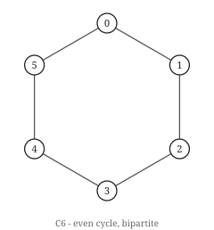
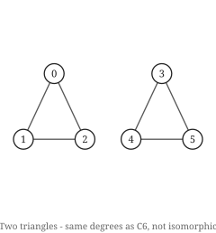

# Hoofdstuk 5 — Isomorfie

Hoofdstuk 1 liet twee viercykels zien die niet gelijk waren. Het was overduidelijk dezelfde
graaf. Die twee zinnen met elkaar verzoenen is waar dit hoofdstuk voor dient, en de verzoening
blijkt een van de vreemdste problemen in de informatica te zijn.

## De definitie

Een **isomorfie** van `G` naar `H` is een bijectie `φ : V(G) → V(H)` zodat `uv ∈ E(G)` dan en
slechts dan als `φ(u)φ(v) ∈ E(H)`. Bestaat er een, dan schrijven we `G ≅ H`.

De definitie is onopvallend. Wat opvallend is, is dat niemand weet hoe moeilijk het is om haar
te beslissen.

Bijna elk natuurlijk probleem in dit boek zit ofwel in `P` — kortste paden, koppeling,
vlakheid — of is `NP`-volledig — kleuring, Hamiltoniciteit, kliek. Grafenisomorfie zit in `NP`,
is niet bekend in `P`, en wordt *ook niet vermoed `NP`-volledig te zijn*, want als het dat was,
zou de polynomiale hiërarchie instorten. Het hoort bij een kleine klasse problemen waarvan
vermoed wordt dat ze werkelijk tussenin liggen. Babai's algoritme uit 2016 loopt in
quasipolynomiale tijd, `exp((log n)^O(1))`, wat sneller is dan elke exponentiële en trager dan
elke polynomiale functie. Dat is de huidige stand, en het is een vreemde plaats voor een
probleem dat zo eenvoudig te formuleren is.

## Invarianten, en wat ze niet kunnen

Een **invariant** is iets dat door isomorfie behouden blijft: `n`, `m`, de graadrij, het aantal
driehoeken, de multiverzameling van componentgroottes. Elke invariant geeft een **eenzijdige
test**. Verschillen twee grafen in enige invariant, dan zijn ze zeker niet isomorf. Komen ze
overeen in alle invarianten die je controleerde, dan heb je niets geleerd.

 

De twee grafen waar dit hoofdstuk om draait: beide 2-regulier op zes knopen, met identieke
graadrijen, en niet isomorf. De ene is samenhangend en de andere niet.

Die asymmetrie is het hele praktische verhaal, en het loont haar als een bewering te
formuleren die de verificatie in beide richtingen kan controleren:

```
  held      ch 5  Isomorphic graphs have equal degree sequences  (52 graphs)
  refuted   ch 5  Equal degree sequences imply isomorphic  (1 graphs)
```

De tweede regel is een *succes*. Ze staat geregistreerd als een stelling waarvan verwacht wordt
dat ze faalt, en de verificatie kleurt rood zodra er geen tegenvoorbeeld meer gevonden wordt.
Het tegenvoorbeeld is het kleinste dat er is:

```python
from graphs.iso import cospectral_mates, canonical

c6, two_triangles = cospectral_mates()
print(c6.degree_sequence())            # [2, 2, 2, 2, 2, 2]
print(two_triangles.degree_sequence()) # [2, 2, 2, 2, 2, 2]
print(canonical(c6) == canonical(two_triangles))   # False
```

De zescykel en twee disjuncte driehoeken zijn beide 2-regulier op zes knopen. Identieke
graadrijen, dezelfde `n`, dezelfde `m`, en niet isomorf — de ene is samenhangend en de andere
niet.

## Kleurverfijning, en haar beruchte blinde vlek

De standaard snelle heuristiek is **kleurverfijning**, ook eendimensionale Weisfeiler–Leman
genoemd. Geef elke knoop dezelfde kleur. Herkleur elke knoop herhaaldelijk met het paar (zijn
huidige kleur, de gesorteerde multiverzameling kleuren van zijn buren). Stop wanneer de
partitie niet meer verandert.

```python
def wl_colours(g, rounds=None):
    colour = [0] * g.n
    for _ in range(rounds if rounds is not None else g.n):
        signature = [
            (colour[v], tuple(sorted(colour[w] for w in g.neighbours(v))))
            for v in g.vertices()
        ]
        relabel = {s: i for i, s in enumerate(sorted(set(signature)))}
        new = [relabel[s] for s in signature]
        if new == colour:
            break
        colour = new
    return colour
```

Het loopt in bijna lineaire tijd en het scheidt vrijwel elk paar grafen dat je tegenkomt. Het
is ook **correct maar niet volledig**: isomorfe grafen krijgen altijd dezelfde
kleurmultiverzameling, dus een verschil bewijst niet-isomorfie, maar overeenstemming bewijst
niets.

De blinde vlek is precies het paar hierboven:

```python
from graphs.iso import wl_signature, wl_distinguishes

print(wl_signature(c6))              # ((0, 6),)
print(wl_signature(two_triangles))   # ((0, 6),)
print(wl_distinguishes(c6, two_triangles))   # False
```

Beide signaturen zeggen "zes knopen, allemaal kleur 0". Verfijning kan niet beginnen, want in
een reguliere graaf ziet elke knoop er identiek uit aan elke andere: dezelfde kleur, dezelfde
multiverzameling buurkleuren, voor altijd. De partitie is stabiel bij ronde nul.

Dit is geen tekortkoming van de implementatie. **Eendimensionale Weisfeiler–Leman kan geen twee
reguliere grafen van dezelfde grootte en graad onderscheiden**, en daar zijn er heel veel van.
De oplossing is `k`-dimensionale WL, die `k`-tallen knopen kleurt in plaats van knopen; 2-WL
scheidt `C₆` van twee driehoeken. Maar voor elke `k` bestaan er grafen waarop `k`-WL faalt, een
resultaat van Cai, Fürer en Immerman dat de hele aanpak als route naar een polynomiaal
algoritme afsloot.

## Wat wel werkt

Combineer ze: eerst verfijning als goedkoop filter, brute kracht alleen wanneer verfijning
onbeslist blijft.

```python
def is_isomorphic(g, h):
    if wl_distinguishes(g, h):
        return False          # cheap, and decisive when it fires
    return canonical(g) == canonical(h)   # expensive, and always right
```

`canonical` neemt de lexicografisch kleinste kantenverzameling over alle `n!` hernoemingen. Het
is correct per constructie en het is geen werktuig — het is een definitie die je kunt
uitvoeren. Dit is wat dat kost, bij het opsommen van elke graaf op `n` knopen op isomorfie na:

```
  n=1:    1 graphs up to isomorphism   (0.00s)
  n=2:    2 graphs up to isomorphism   (0.00s)
  n=3:    4 graphs up to isomorphism   (0.00s)
  n=4:   11 graphs up to isomorphism   (0.01s)
  n=5:   34 graphs up to isomorphism   (0.53s)
  n=6:  156 graphs up to isomorphism   (71.82s)
```

Eén knoop erbij kost **135 keer zoveel tijd**. Twee factoren stapelen zich op: het aantal
gelabelde grafen is `2^C(n,2)`, wat bij elke stap met `2^n` vermenigvuldigt, en de canonieke
vorm kost `n!`. Daarom draait de verificatie standaard uitputtend tot `n = 5` en heeft ze een
expliciete `--exhaustive`-vlag nodig voor `n = 6`, en daarom is `n = 7` — 1044
isomorfieklassen, een getal dat klein oogt — met deze methode volstrekt onbereikbaar.

Echte isomorfiesoftware (`nauty`, `bliss`, `traces`) doet verfijning met individualisatie:
verfijn, en wanneer de partitie stabiliseert zonder alles te scheiden, kies één knoop, geef die
een unieke kleur, verfijn opnieuw, en backtrack over die keuze. In de praktijk is dat snel op
vrijwel alles, ook op grafen die speciaal geconstrueerd zijn om het te verslaan. Het slechtste
geval blijft exponentieel.

De aantallen zelf — 1, 2, 4, 11, 34, 156, 1044 — zijn het herkennen waard. Het is OEIS A000088,
en dat de bruteforce-opsommer van dit boek ze reproduceert, is een controle op `canonical` die
geen stelling van mij kon leveren.

## Probeer het

Kijk hoe de goedkope test faalt en de dure slaagt op hetzelfde paar:

```bash
python -c "
import sys, time; sys.path.insert(0, '.')
from graphs.iso import cospectral_mates, wl_distinguishes, canonical
a, b = cospectral_mates()
print('same degree sequence: ', a.degree_sequence() == b.degree_sequence())
print('refinement separates: ', wl_distinguishes(a, b))
print('actually isomorphic:  ', canonical(a) == canonical(b))
"
```

```
same degree sequence:  True
refinement separates:  False
actually isomorphic:   False
```

Drie regels, en de middelste is het onderwerp van dit hoofdstuk: een test die zegt "ik kan het
niet zien" is geen test die "ja" zegt.

## Oefeningen

1. Zijn `C₆` en twee disjuncte driehoeken isomorf? Geef een reden die geen enkele berekening
   vergt.
2. De graadrij is een invariant. Leg in één zin uit waarom dat haar bruikbaar maakt om isomorfie
   te weerleggen en onbruikbaar om haar te bewijzen.
3. Waarom slaagt kleurverfijning er niet in om twee reguliere grafen van dezelfde graad en
   grootte te scheiden?
4. Hoeveel grafen op 4 knopen zijn er op isomorfie na? Controleer je antwoord tegen
   `all_graphs_up_to_iso(4)`.

Oplossingen in Bijlage E.

## Kernpunten

- Isomorfie is hernoemen. Gelijkheid van gelabelde grafen is een andere en veel sterkere
  relatie.
- Het probleem zit in `NP`, is niet bekend in `P`, en wordt vermoed niet `NP`-volledig te zijn —
  een werkelijk ongebruikelijke status. Babai's quasipolynomiale algoritme is het snelst
  bekende.
- Invarianten zijn eenzijdig. Een verschil weerlegt isomorfie; overeenstemming bewijst niets.
- Kleurverfijning is snel, correct, en blind voor reguliere grafen van gelijke graad. `C₆` tegen
  twee driehoeken is het kleinste getuigenis, en geen enkele `k` repareert de aanpak in het
  algemeen.
- Canonieke vormen met brute kracht kosten `n!` en houden op bruikbaar te zijn rond `n = 6`:
  0,53 seconde bij `n = 5`, 71,8 bij `n = 6`.
