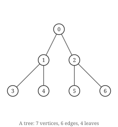

# Hoofdstuk 6 — Bomen

Een boom is de kleinste samenhangende graaf op zijn knopen, de grootste cykelvrije, en de enige
waarin elk paar knopen op precies één manier verbonden is. Dat zijn drie verschillende zinnen
die hetzelfde object beschrijven, en dit hoofdstuk bewijst dat ze het zijn.

## Vijf definities

> **Stelling.** Voor een graaf `G` op `n ≥ 1` knopen zijn de volgende uitspraken equivalent:
>
> 1. `G` is samenhangend en cykelvrij.
> 2. `G` is samenhangend en `m = n − 1`.
> 3. `G` is cykelvrij en `m = n − 1`.
> 4. Elke twee knopen zijn door precies één pad verbonden.
> 5. `G` is samenhangend, en elke kant verwijderen maakt hem onsamenhangend.

Een graaf die aan een van deze voldoet heet een **boom**. Een cykelvrije graaf — een disjuncte
vereniging van bomen — is een **bos**.

*Bewijs.* We tonen 1 ⟹ 4 ⟹ 5 ⟹ 2 ⟹ 3 ⟹ 1.

**1 ⟹ 4.** Samenhang geeft minstens één pad tussen elke `u` en `v`. Waren er twee verschillende
paden `P` en `Q`, neem dan `x` als de eerste knoop waarna ze uiteenlopen en `y` als de
eerstvolgende knoop die ze delen. Het stuk van `P` van `x` naar `y` en het omgekeerde van `Q`
van `y` naar `x` vormen samen een gesloten wandeling zonder herhaalde knoop behalve de
eindpunten — een cykel, in tegenspraak met cykelvrijheid.

**4 ⟹ 5.** Unieke paden geven samenhang meteen. Zou `G` na verwijdering van `uv` samenhangend
blijven, dan bestond er een pad van `u` naar `v` dat `uv` vermijdt, wat samen met de kant `uv`
twee verschillende `u`–`v`-paden geeft.

**5 ⟹ 2.** Inductie naar `n`. Voor `n = 1` is `m = 0`. Voor `n ≥ 2`: kies een kant `uv`. Hem
verwijderen laat precies twee componenten achter (het lemma van hoofdstuk 4 begrenst de
splitsing op twee, en ze is minstens twee per aanname), zeg `G₁` en `G₂` met `n₁ + n₂ = n`.
Beide erven eigenschap 5, dus hebben per inductie `nᵢ − 1` kanten. Dan is
`m = (n₁ − 1) + (n₂ − 1) + 1 = n − 1`.

**2 ⟹ 3.** Stel dat `G` samenhangend is met `m = n − 1` en een cykel bevat. Een kant van die
cykel verwijderen houdt de graaf samenhangend — de twee eindpunten zijn nog steeds langs de
lange weg verbonden — en laat `n − 2` kanten op `n` knopen achter, in tegenspraak met de grens
`m ≥ n − 1` van hoofdstuk 4 voor samenhangende grafen.

**3 ⟹ 1.** Zij `G` cykelvrij met componenten `C₁, …, C_k`, elk van grootte `nᵢ`. Elke component
is samenhangend en cykelvrij, dus heeft per 1 ⟹ 2 (al bewezen via 4 en 5) `nᵢ − 1` kanten.
Sommeren geeft `m = n − k`. Omdat `m = n − 1` volgt `k = 1`, dus `G` is samenhangend. ∎

Vijf eigenschappen, één object. In de praktijk gebruik je die welke het goedkoopst is voor het
argument dat voorligt — meestal 2 om te tellen, 4 voor constructies, en 5 wanneer je iets moet
weglaten.

De verificatie controleert de equivalentie van 1 en 2 zonder een van beide als definitie te
gebruiken: cykelvrijheid wordt getest door cykels op te sommen, niet via de snelweg
`m = n − 1`, want die gebruiken zou de bewering circulair maken.

```
  held      ch 6  Tree iff connected and acyclic iff connected with m = n - 1  (52 graphs)
  held      ch 6  A tree has a unique path between any two vertices  (7 graphs)
  held      ch 6  Removing any edge of a tree disconnects it  (7 graphs)
```

## Bladeren



Zeven knopen, zes kanten, vier bladeren — en geworteld getekend, hoewel een boom geen wortel
heeft tot je er een kiest.

Een **blad** is een knoop van graad 1.

> **Stelling.** Elke boom op `n ≥ 2` knopen heeft minstens twee bladeren.

*Bewijs.* Neem een langste pad `P = v₀ v₁ … v_k` in `G`; omdat `n ≥ 2` en `G` samenhangend is,
geldt `k ≥ 1`. Elke buur van `v₀` ligt op `P` — anders kon `P` verlengd worden, in tegenspraak
met maximaliteit. En `v₀` heeft geen andere buur op `P` dan `v₁`, want `v₀ vᵢ` met `i ≥ 2` zou
een cykel sluiten. Dus `deg(v₀) = 1`, en hetzelfde argument geldt bij `v_k`. ∎

**De langste-padtruc** is het waard uit dit bewijs te lichten. Een maximaal object nemen en
constateren dat zijn maximaliteit de uiteinden vastlegt, is een van de weinige werkelijk
algemene zetten in de grafentheorie; hij keert terug in hoofdstuk 20 voor Hamiltoniciteit en in
hoofdstuk 15 voor degeneratie-ordeningen.

```python
from graphs.core import Graph
from graphs.algorithms import is_tree

t = Graph(7, [(0, 1), (0, 2), (1, 3), (1, 4), (2, 5), (2, 6)])
print(is_tree(t), t.n, t.m)                                  # True 7 6
print([v for v in t.vertices() if t.degree(v) == 1])         # [3, 4, 5, 6]
```

Bladeren zijn wat inductie op bomen laat werken. Vrijwel elk bewijs over bomen in dit boek gaat
door een blad te verwijderen, de inductiehypothese op de kleinere boom toe te passen, en het
blad terug te zetten — en de bovenstaande stelling is wat garandeert dat er altijd een blad is
om te verwijderen.

## Kanten toevoegen en verwijderen

Twee complementaire feiten, beide onmiddellijk uit de equivalenties, en beide voortdurend
gebruikt in hoofdstuk 9:

> **Lemma (de verwisselingsfeiten).** Zij `T` een boom.
>
> - Een kant toevoegen die er nog niet is, creëert **precies één** cykel.
> - Een willekeurige kant verwijderen splitst `T` in **precies twee** componenten.

*Bewijs.* Voor het eerste: `T` heeft per eigenschap 4 een uniek pad `P` van `u` naar `v`, dus
`uv` toevoegen creëert de cykel `P + uv`. Elke cykel door de nieuwe kant moet een `u`–`v`-pad in
`T` gebruiken, en dat is er maar één, dus deze cykel is uniek. Elke cykel die niet door de
nieuwe kant gaat, zou een cykel in `T` zijn. Voor het tweede: eigenschap 5 geeft minstens twee
componenten, en het lemma van hoofdstuk 4 geeft er hoogstens twee. ∎

Zet ze naast elkaar en je krijgt de **verwisselingseigenschap**: voeg je een kant toe aan een
boom en verwijder je vervolgens een willekeurige kant van de ontstane cykel, dan heb je weer een
boom. Die enkele waarneming is de motor van beide minimale-opspannendeboomalgoritmen in
hoofdstuk 9, en van het twee-verwisselingsargument dat je al zag in hoofdstuk 3.

## Bomen zijn bipartiet

> **Gevolg.** Elke boom is bipartiet.

*Bewijs.* Een boom heeft geen cykels, dus in het bijzonder geen oneven cykels, en de stelling
van hoofdstuk 16 geeft bipartietheid. Of rechtstreeks: worteel de boom waar dan ook en kleur
elke knoop naar de pariteit van zijn diepte. Aangrenzende knopen verschillen precies één in
diepte, dus ze verschillen in pariteit. ∎

Het rechtstreekse argument is het bruikbare, want het geeft je ook de tweekleuring expliciet:
het is de pariteit van de afstand tot de wortel.

## Probeer het

Overtuig jezelf met de hand van de verwisselingseigenschap — voeg een kant toe en kijk hoe er
precies één cykel verschijnt:

```bash
python -c "
import sys; sys.path.insert(0, '.')
from graphs.core import Graph
from graphs.algorithms import is_tree, is_connected

t = Graph(5, [(0,1),(1,2),(2,3),(3,4)])
print('a path is a tree:', is_tree(t), 'm =', t.m, 'n-1 =', t.n - 1)
t.add_edge(0, 4)
print('after adding 0-4: is_tree =', is_tree(t), 'm =', t.m)
t.remove_edge(2, 3)
print('after removing 2-3 from the cycle: is_tree =', is_tree(t), 'connected =', is_connected(t))
"
```

```
a path is a tree: True m = 4 n-1 = 4
after adding 0-4: is_tree = False m = 5
after removing 2-3 from the cycle: is_tree = True connected = True
```

Een kant toevoegen brak de boom; een *andere* kant van de ontstane cykel verwijderen herstelde
er een. Dat is de verwisselingseigenschap, en hoofdstuk 9 maakt er een algoritme van.

## Oefeningen

1. Een boom heeft 12 knopen. Hoeveel kanten heeft hij?
2. Wat is het kleinste aantal bladeren dat een boom op `n ≥ 2` knopen kan hebben, en welke boom
   bereikt het?
3. Je voegt één kant toe aan een boom. Hoeveel cykels bevat het resultaat?
4. Elke boom is bipartiet. Is elke bipartiete graaf een boom? Geef een getuigenis.

Oplossingen in Bijlage E.

## Kernpunten

- Vijf definities van een boom, allemaal equivalent. Gebruik die welke het bewijs het kortst
  maakt: `m = n − 1` om te tellen, unieke paden om te construeren, "elke kant is een brug" voor
  verwijderingsargumenten.
- Elke boom met minstens twee knopen heeft minstens twee bladeren, bewezen met de
  langste-padtruc — een zet die door het hele boek terugkeert.
- Een kant toevoegen creëert precies één cykel; een kant verwijderen creëert precies twee
  componenten. Samen geven ze de verwisselingseigenschap, die hoofdstuk 9 aandrijft.
- Inductie op bomen betekent een blad verwijderen. De twee-bladerenstelling is wat dat altijd
  mogelijk maakt.
