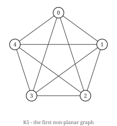

# Hoofdstuk 17 — Vlakheid

Een graaf is **vlak** wanneer hij in het platte vlak getekend kan worden zonder dat kanten elkaar
kruisen. Hoofdstuk 1 hield vol dat een graaf geen meetkunde heeft; vlakheid is de uitzondering die
de regel bevestigt, want ze kwantificeert over *alle* tekeningen. De tekening die jij maakte zegt
niets. Het bestaan van een goede is een eigenschap van de graaf.

## Wat een tekening eigenlijk is

Om over tekeningen te redeneren zonder topologie te bedrijven, vervang je ze door iets eindigs. Een
**rotatiesysteem** kent elke knoop een cyclische volgorde van zijn buren toe. Dat is de volledige
combinatorische inhoud van een inbedding in een oriënteerbaar oppervlak: geen coördinaten, geen
lengtes, alleen "welke kant komt hierna wanneer je om deze knoop draait".

Uit een rotatiesysteem kun je **vlakdelen** mechanisch aflopen. Kom je in `v` aan langs `uv`,
vertrek dan langs de buur die op `u` volgt in de cyclische volgorde van `v`; ga door tot je terug
bent waar je begon.

```python
def _trace_faces(g, rotation):
    nxt = {}
    for v, order in rotation.items():
        pos = {w: i for i, w in enumerate(order)}
        for u in order:
            nxt[(u, v)] = (v, order[(pos[u] + 1) % len(order)])
    unvisited, count = set(nxt), 0
    while unvisited:
        arc = next(iter(unvisited)); count += 1
        while arc in unvisited:
            unvisited.discard(arc); arc = nxt[arc]
    return count
```

Zo werkt `is_planar` in dit boek: probeer rotatiesystemen tot er een `n − m + f = 2` geeft. Het kost
`∏(deg(v) − 1)!` — 1024 systemen voor de Petersen-graaf, hopeloos voor `K₆`. Echte vlakheidstests
zijn `O(n)` (Hopcroft–Tarjan, of het links-rechtsalgoritme), en dit boek implementeert die niet,
omdat hun correctheid een apart betoog van twintig bladzijden is dat je niets over vlakheid zou
leren.

## De formule van Euler

> **Stelling (Euler, 1758).** Voor een samenhangende vlakke graaf geldt `n − m + f = 2`.

*Bewijs.* Inductie naar `m`. Is `G` een boom, dan `m = n − 1` en `f = 1`, wat `n − (n−1) + 1 = 2`
geeft. Anders heeft `G` een cykel; verwijder een van zijn kanten. De graaf blijft samenhangend, en de
twee vlakdelen aan weerszijden van die kant versmelten tot één, dus `m` en `f` dalen elk met één en
`n − m + f` blijft gelijk. ∎

De verificatie kent hier een valstrik die het benoemen waard is: **je kunt de formule van Euler niet
controleren door `f` uit de formule van Euler te berekenen.** De verificatie haalt `f` op door de
vlakdelen van een werkelijke inbedding af te lopen, en controleert pas daarna de identiteit:

```
  held      ch17  Euler's formula: n - m + f = 2 for connected planar graphs  (30 graphs)
```

Voor onsamenhangende grafen luidt de formule `n − m + f = 1 + k` met `k` componenten. De
gebruikelijke formulering neemt samenhang stilzwijgend aan.

## De kantengrens, en waarom ze niet volstaat

> **Gevolg.** Een enkelvoudige vlakke graaf met `n ≥ 3` heeft `m ≤ 3n − 6`. Is hij bovendien
> driehoekvrij, dan `m ≤ 2n − 4`.

*Bewijs.* Elk vlakdeel wordt door minstens 3 kanten begrensd, en elke kant grenst aan hoogstens 2
vlakdelen, dus `2m ≥ 3f`. Invullen van `f = 2 − n + m` geeft `2m ≥ 3(2 − n + m)`, dus `m ≤ 3n − 6`.
Driehoekvrij betekent dat elk vlakdeel minstens 4 kanten heeft, wat `2m ≥ 4f` en de tweede grens
geeft. ∎

Dat is opnieuw een dubbeltelling — de techniek uit hoofdstuk 3, voor de derde keer.

`K₅` heeft `n = 5`, `m = 10 > 9`, dus hij is niet vlak. Klaar in één regel.

`K₃,₃` heeft `n = 6`, `m = 9 ≤ 12`, dus de grens zegt niets. Hij is toch niet vlak, en dat is het
punt: **de Euler-grens is noodzakelijk, niet voldoende.** De verificatie registreert het omgekeerde
als een stelling waarvan verwacht wordt dat ze weerlegd wordt:

```
  refuted   ch17  m <= 3n - 6 implies planar  (9 graphs)
```

De driehoekvrije grens vangt hem wel: `K₃,₃` is bipartiet, en `9 > 2·6 − 4 = 8`. Twee grenzen, en je
moet weten welke van toepassing is.

```
  K4        n=4   m=6   planar=True   euler_bound=True   bip_bound=False  faces=4
  K5        n=5   m=10  planar=False  euler_bound=False  bip_bound=False  faces=None
  K33       n=6   m=9   planar=False  euler_bound=True   bip_bound=False  faces=None
  petersen  n=10  m=15  planar=False  euler_bound=True   bip_bound=True   faces=None
```

De Petersen-graaf doorstaat **beide** grenzen en is nog steeds niet vlak. Geen enkel telargument over
`n` en `m` zal vlakheid ooit beslissen, want vlakheid gaat niet over hoeveel kanten er zijn.

## Kuratowski en Wagner

 

De twee verboden minoren. Elke tekening van beide heeft een kruising, en elke niet-vlakke graaf bevat
er een van.

> **Stelling (Kuratowski, 1930).** `G` is vlak dan en slechts dan als hij geen *onderverdeling* van
> `K₅` of `K₃,₃` bevat.
>
> **Stelling (Wagner, 1937).** `G` is vlak dan en slechts dan als hij geen `K₅`-*minor* en geen
> `K₃,₃`-minor heeft.

Een **onderverdeling** vervangt kanten door paden; een **minor** ontstaat door knopen te verwijderen,
kanten te verwijderen, en kanten samen te trekken. De twee stellingen zijn hier equivalent, al zijn
minoren het robuustere begrip en degene waarop hoofdstuk 31 voortbouwt.

Twee verboden grafen, en dat is het volledige antwoord — een opmerkelijk kleine verzameling
belemmeringen voor zo'n rijke eigenschap. Hoofdstuk 31 legt uit waarom elke minor-gesloten eigenschap
een eindige belemmeringsverzameling heeft, wat Robertson–Seymour is, en waarom die stelling
niet-constructief is.

De verificatie controleert Wagner tegen de inbeddingszoektocht — twee volstrekt ongerelateerde
berekeningen:

```
  held      ch17  Wagner: planar iff no K5 minor and no K3,3 minor  (52 graphs)
```

De Petersen-graaf is de standaardillustratie: trek de vijf spaken samen en je krijgt `K₅`.

## Gevolgen

Vlakke grafen zijn ijl (`m < 3n`), dus `m = O(n)` en ze hebben een knoop van graad hoogstens 5 — de
gemiddelde graad is onder 6. Dat ene feit geeft:

- **De zeskleurenstelling**, onmiddellijk: degeneratie `≤ 5`, dus `χ ≤ 6` per hoofdstuk 15.
- **De vijfkleurenstelling**, met een Kempe-ketenargument (hoofdstuk 18).
- **De vierkleurenstelling**, met 633 configuraties en een computer (hoofdstuk 18).

Vlakke grafen hebben ook `O(√n)`-separatoren (Lipton–Tarjan), wat verdeel-en-heersaanpakken erop
laat werken en de reden is dat veel `NP`-moeilijke problemen subexponentiële algoritmen hebben
zodra de invoer vlak is.

## Probeer het

```bash
python -c "
import sys; sys.path.insert(0, '.')
from graphs.core import complete, complete_bipartite, petersen, cycle
from graphs.planar import is_planar, euler_bound, bipartite_euler_bound, planar_face_count
for name, g in [('K4', complete(4)), ('K5', complete(5)),
                ('K3,3', complete_bipartite(3,3)), ('petersen', petersen())]:
    print(f'{name:<9} m<=3n-6: {euler_bound(g)!s:<6} m<=2n-4: {bipartite_euler_bound(g)!s:<6} planar: {is_planar(g)}')
f = planar_face_count(complete(4))
print()
print('K4 faces from a real embedding:', f, ' n - m + f =', 4 - 6 + f)
"
```

```
K4        m<=3n-6: True   m<=2n-4: False  planar: True
K5        m<=3n-6: False  m<=2n-4: False  planar: False
K3,3      m<=3n-6: True   m<=2n-4: False  planar: False
petersen  m<=3n-6: True   m<=2n-4: True   planar: False

K4 faces from a real embedding: 4  n - m + f = 2
```

`K₄` in het vlak getekend heeft vier vlakdelen — drie driehoeken en het buitengebied — en de formule
van Euler klopt op een getal dat afgelopen werd in plaats van aangenomen.

## Oefeningen

1. Gebruik de formule van Euler om te tonen dat elke vlakke graaf een knoop van graad hoogstens 5
   heeft.
2. Toon aan dat `K₅` min een willekeurige kant vlak is.
3. De Petersen-graaf doorstaat beide kantengrenzen. Geef een kort argument dat hij toch niet vlak is,
   zonder Kuratowski aan te roepen.
4. Hoeveel vlakdelen heeft een vlakke inbedding van een boom op `n` knopen? Controleer tegen de
   formule van Euler.

Oplossingen in Bijlage E.

## Kernpunten

- Vlakheid kwantificeert over alle tekeningen, dus ze is een eigenschap van de graaf ook al is een
  tekening dat niet.
- Een rotatiesysteem is de volledige combinatorische inhoud van een tekening. Vlakdelen kunnen er
  mechanisch uit afgelopen worden, en `n − m + f = 2` karakteriseert vlakheid.
- Controleer de formule van Euler met een vlakdeeltelling uit een werkelijke inbedding. `f` berekenen
  door de formule om te schrijven test niets.
- `m ≤ 3n − 6` is noodzakelijk, niet voldoende — `K₃,₃` doorstaat haar. De driehoekvrije verfijning
  `m ≤ 2n − 4` vangt `K₃,₃` maar niet de Petersen-graaf. Geen kantentellend argument beslist vlakheid.
- Kuratowski en Wagner: twee verboden structuren, en dat is het hele antwoord.
- Vlakke grafen zijn ijl en 5-degeneraat, wat je de zeskleurenstelling gratis oplevert.
